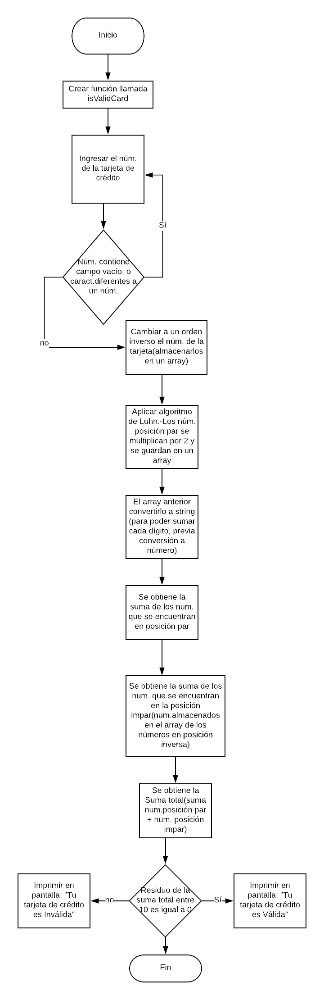

# TARJETA DE CRÉDITO VÁLIDA

### Descripción
Programa que verifica si un número de tarjeta de crédito es válida conforme el algoritmo de Luhn, también llamado algoritmo de módulo 10 (algoritmo de suma de verificación, utilizada para validar una diversidad de números de identificación).

Crea una web que pida, por medio de un prompt(), el número de una tarjeta de crédito y confirme su validez.

### Consideraciones específicas
1. Crea una función llamada isValidCard.
2. El usuario no debe poder ingresar un campo vacío.

## Pseudocódigo
### Descripción
En esta parte se describe la funcionalidad del proyecto descrito en pasos.

#### Entrada
Crear una función llamada isValidCard.

#### Proceso
1. Dentro de la función previamente realizada, se declara una variable llamada numberOfCreditCard, esta estará definida por un prompt(), en el cual, el usuario ingresará el número de su tarjeta de crédito.
De igual manera, el usuario no debe ingresar un campo vacío, dentro de la función poner la condicional que revisará si esta acción se está llevando a cabo, en caso de que esto suceda, volverá a aparecer dicho prompt, en espera de que el usuario brinde un número de tarjeta de crédito.También se debe verificar que el dato ingresado sea un carácter del tipo número y no una letra, en caso contrario, aparecerá un alert() solicitando que ingrese el número de la tarjeta y posteriomente se cerrará el cuadro de diálogo. De igual manera, si el usuario da clik en cancelar el cuadro de diálogo se cerrará.

2. Posteriormente, se deben pasar los números de la tarjeta (string) a un array en orden inverso, ante esto, declarar una nueva variable llamada arrayOfInverseNumbers y definirla como array vacío.
Realizar un ciclo for, el cual en cada iteración va a ir agregando el último número del array de la variable arrayOfNumbersOfCreditCard a la variable arrayOfInverseNumbers, mediante el método Array.prototype.push() y el uso de los índices.

3. Aplicar la operación a los números de las posiciónes pares.-Es decir, los números del array de la variable arrayOfInverseNumbers que se encuentran en las posiciones pares se les debe multiplicar por dos y si el doble de ese número es mayor o igual a 10 se deben sumar los dígitos del resultado, posteriormente sumar entre si los números de las posiciones pares restantes que únicamente contienen un dígito (menor a 10).

4. Sumar los números de las posiciones impares mediante un ciclo for.

5. Suma total.- Resultado de la suma de números de las posiciones pares junto con los números de las posiciones impares.

### Salida
1. Comprobar si es una tarjeta de crédito válida llamando a la función isValidCard().-Mediante el resultado de la suma, se debe obtener el residuo de la división entre 10 y si su residuo es igual a cero, aparecerá en la pantalla que sí es una tarjeta de crédito válida, en caso contrario, aparecerá en la pantalla que no es una tarjeta de crédito válida (dicha verificación se realizará mediante una condicional).

## Diagrama de flujo

### Descripción:
Mediante el diagrama de flujo se muestra la representación gráfica del pseudocódigo.  

